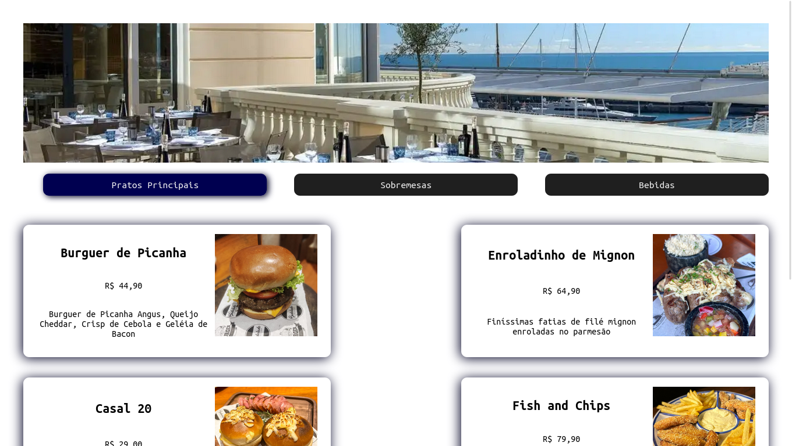

# Hashtaurante

Um cardápio de restaurante desenvolvido usando React.JS e Vite desenvolvido durante o Intensivão de JavaScript da HashTag Treinamentos 

## Tecnologias usadas
- HTML
- CSS
- JavaScript
- Vite
- React.JS